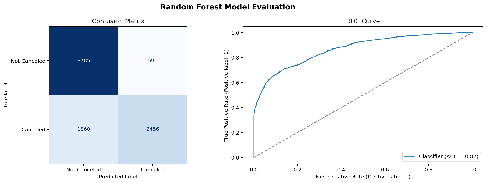
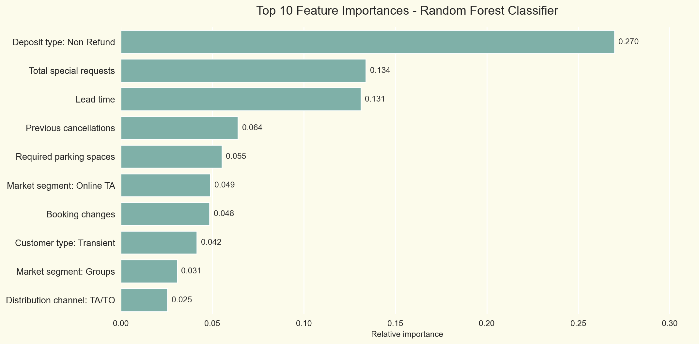

# Hotel Booking Cancellation Prediction

Machine learning classification project for predicting whether a hotel booking is likely to be canceled.

This project is part of my Data Analytics and Data Science portfolio. It focuses on framing a practical business problem, cleaning and preparing hotel booking data, evaluating classification models, and interpreting the drivers of cancellation risk.

## Project Overview

Hotel cancellations can affect revenue planning, staffing, inventory management, and overbooking strategy. The goal of this project is to predict cancellation risk using booking-related information available at booking time or shortly after booking.

The final portfolio version avoids using variables that may reveal information from after the booking outcome, such as reservation status dates or later operational assignment fields.

## Business Question

Can we predict whether a hotel booking will be canceled using booking characteristics such as lead time, deposit type, market segment, customer type, previous cancellations, and special requests?

## Dataset

The dataset contains hotel booking records with information about:

- booking dates and stay duration,
- guest composition,
- booking channel and market segment,
- room type,
- deposit type,
- prior customer behavior,
- special requests,
- cancellation status.

The data dictionary is available in [reports/dataset_dictionary.md](reports/dataset_dictionary.md).

## Modeling Approach

The project includes:

- exploratory data analysis,
- target distribution analysis,
- feature availability and leakage review,
- preprocessing with scaling and categorical encoding,
- SMOTE resampling for class imbalance,
- baseline model comparison,
- Random Forest model tuning,
- classification report and ROC-AUC evaluation,
- feature importance interpretation.

## Final Model Performance

Final Random Forest test performance:

| Metric | Value |
|---|---:|
| Accuracy | 0.84 |
| Weighted F1-score | 0.83 |
| ROC-AUC score | 0.87 |
| Canceled precision | 0.81 |
| Canceled recall | 0.61 |
| Canceled F1-score | 0.70 |

The model is relatively precise when it flags a booking as likely to be canceled, but it still misses some actual cancellations. This trade-off matters in a hotel business context because false positives and false negatives can have different operational and revenue-management costs.

## Model Evaluation Visuals

### Confusion Matrix and ROC Curve



### Feature Importance



## Key Predictors

The feature-importance results are also consistent with business intuition: cancellation behavior is shaped by commitment signals, booking timing, customer history, and sales-channel patterns.

| Top driver | Business interpretation |
|---|---|
| Deposit type: Non Refund | Deposit policy is strongly linked to cancellation behavior because non-refundable bookings usually represent a stronger financial commitment. |
| Total special requests | Guests with special requests may show stronger booking intent because they are already planning specific details of the stay. |
| Lead time | Bookings made far in advance tend to carry different cancellation risk because plans can change before the stay date. |
| Previous cancellations | Past customer behavior is predictive because guests with prior cancellations may be more likely to cancel again. |
| Required parking spaces | Parking requests can signal stronger commitment or a specific travel context, especially for guests arriving by car. |
| Market segment: Online TA | Online travel agency bookings may follow different cancellation patterns because customers can compare and change options more easily. |
| Booking changes | Modified bookings may indicate uncertainty, but they can also show active planning, making this a useful behavioral signal. |
| Customer type: Transient | Individual or short-term bookings behave differently from group, contract, or repeat customer bookings. |
| Market segment: Groups | Group bookings have different cancellation dynamics because they often depend on coordinated plans and group-level decisions. |
| Distribution channel: TA/TO | Travel agency and tour operator channels can behave differently because booking policies, customer expectations, and cancellation conditions vary by channel. |

## Repository Structure

```text
hotel-booking-cancellation-prediction/
  data/
    train_final.csv
    test_final.csv
  models/
    preprocessing_transformer.pkl
    random_forest_model.pkl
  notebooks/
    01_hotel_booking_cancellation_analysis.ipynb
  reports/
    dataset_dictionary.md
  README.md
  requirements.txt
```

## How To Run

1. Clone the repository.
2. Install the dependencies:

```bash
pip install -r requirements.txt
```

3. Open and run the notebook:

```text
notebooks/01_hotel_booking_cancellation_analysis.ipynb
```

## Current Status

Portfolio-ready draft. Next improvements:

- simplify the notebook for smoother reading,
- create a short portfolio website page,
- optionally package the preprocessing and model inference workflow as a Python script.

## Author

Created by **Lissette Valdes**.

- GitHub: [github.com/luthien4](https://github.com/luthien4)
- Portfolio: [luthien4.github.io/LissetteDoesWebPortfolio.github.io](https://luthien4.github.io/LissetteDoesWebPortfolio.github.io/)
- LinkedIn: [lissette-valdes-valdes-b987651](https://www.linkedin.com/in/lissette-valdes-valdes-b987651/)
